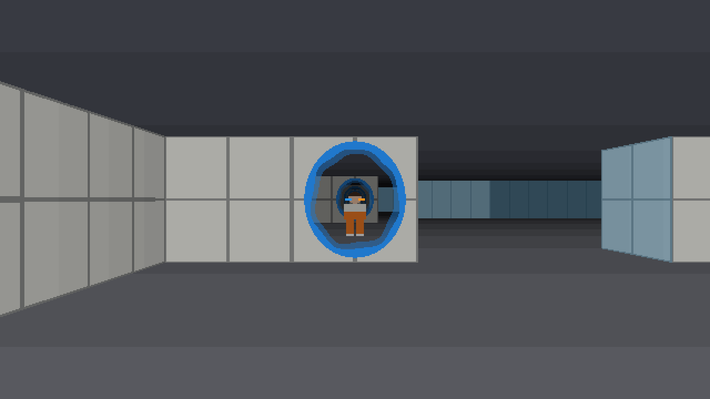
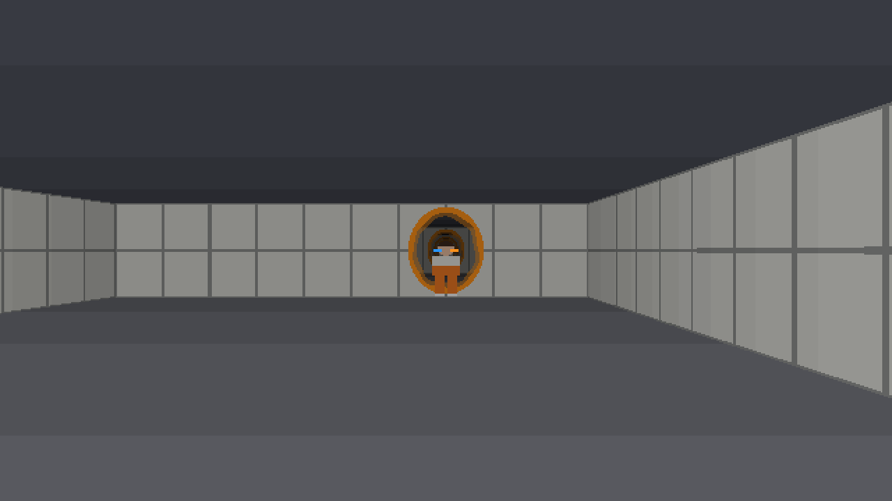
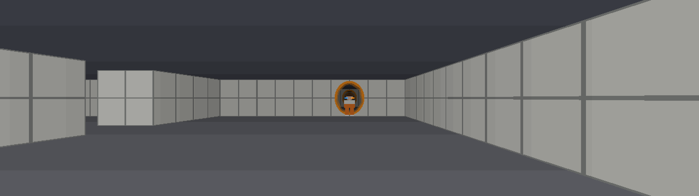

# portal-bend

Portal, written in **Bend 2**. A raycaster built from scratch, portals you shoot on the walls yourself, momentum that goes through with you and... you can **see yourself** walking through the portal.



All of that in a pure functional language: no loops, no mutable variables, no arrays. Just `match`, recursion and a quadtree.

---

## Why does this exist?

I wanted to REALLY understand Bend, and nothing teaches you more than trying to make a game run at 60 FPS in a language that **has no for loop**.

Here's what's inside:

- **DDA raycasting**, column by column, just like Wolfenstein.
- **Portals you place yourself**: a ray goes into one portal and comes out of the other, up to 8 times in a row.
- **Physics with momentum**: jumped into a portal head first? You come out on the other side at the same speed, turned to face the exit.
- **Funneling**: got close to the portal mouth a bit off center? The game pulls you to the middle, just like the real Portal.
- **Your body shows up through the portals**, even in the middle of a crossing: half of you on one side, half on the other.
- **Responsive window**: it tiles in Hyprland (nothing floating) and the render adapts to the tile size.



---

## Running it

You need Linux with X11 or XWayland, and **Bend 2.0.8**:

```bash
curl -fsSL https://bend-lang.com/install.sh | sh
```

Then just:

```bash
./play.sh
```

`play.sh` rebuilds the game when any `.bend` or `.c` file changes, and runs it with `--threads 4`.

But Daniel, why only 4 threads? Because the default uses ALL your cores, and for a small frame, waking up 32 workers costs more than drawing the screen. With 4 it holds 60 FPS.

### Controls

| Key | What it does |
|-----|--------------|
| `W` `A` `S` `D` | move and strafe |
| `Space` | jump |
| mouse or arrow keys | turn and tilt the camera |
| `Q` or left button | blue portal |
| `E` or right button | orange portal |
| `R` | restart |
| `Esc` | quit |

While the window has focus, the mouse is **held at the center** and the cursor is hidden. Switched to another window? The mouse goes back to normal and every key is released, so nothing gets "stuck" when you come back.

---

## How the code is organized

```text
portal.bend           game loop: read the window, draw, apply events and physics
game/
  core/     config (constants), types (all the data), num (small math)
  world/    level (16x16 map), face and portals (geometry), ray (raycast through portals), ghost (your body and its clone)
  render/   proj, color, col and cols (columns), summary (compression), shade (pixel), view (frame quadtree)
  play/     keys, gun, move (collision and crossing), tick (events and physics)
  host/     screen (window size, tiling and mouse capture, in C)
tests/      physics, snapshots and benchmarks
```

One frame, start to finish:

```text
  Screen.sync (C) ──► Tick.sense ──► View.of ──► Window.frame ──► Tick.fold + Tick.after
  size, mouse,        turn the        quadtree     paint it and      keys, shots, physics
  focus               camera                       return events
```

---

## The trick that makes it fast: the quadtree

In Bend, the screen is an `Image`: a quadtree where each leaf is a color. Painting 1280x720 pixel by pixel is WAY too expensive. BUTTTT if a whole block of the screen has a single color (a piece of the ceiling, the middle of a wall), it becomes **a single node**.

To know that without looking at every pixel, each raycast column builds a **summary** (`T.Sum`): where the wall starts and ends, where the portal ellipse is, where the floor shows up... and the summaries get merged into a tree of columns. When the quadtree is built, each block asks the summary: "am I uniform?". If yes, **plau**, one `Pix` and done.

And this compression is **lossless**. The tests compare the compressed frame with a frame drawn pixel by pixel, and the difference has to be ZERO.

---

## What about the body going through the portal?

When you're in the middle of a portal, the game draws **two bodies**:

- the original, clipped by the plane of the entry portal;
- a clone, moved by the same transform as the teleport and clipped by the plane of the exit portal.

Each one only shows on the "right" side of its own plane. The result: half of you goes into one portal while the other half is already coming out of the other.

---

## Responsive window

Bend's `Window.open` creates a fixed size window, and Hyprland floats every fixed size window. `game/host/screen.c` fixes that: it removes the fixed size, maps the window again and reads the current size on every frame.

The field of view is **Hor+**: the height sets the scale, and the width sets how much you see to the sides. Wide tile? Panoramic view. Tall tile? Same scene, with more floor and ceiling.



---

## Tests

```bash
bend tests/physics.bend                                    # jump, wall, crossing and funneling scenarios
bend tests/snapshot.bend | python3 tests/snapshot.py snaps # scenes as PNG, at several window sizes
bend tests/bench.bend -o bench && ./bench --threads 4      # 300 frames
```

The snapshots don't open any window: Bend prints the quadtree and Python builds the PNG.

---

From the community, to the community. Fill your water bottle xD
