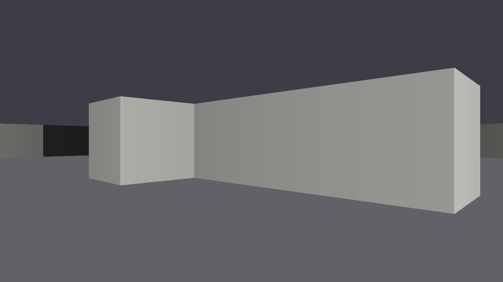

# GPU rendering in Bend: what portal-bend taught us

> A field report from building a Portal raycaster in Bend 2. We tried the GPU **before** `SHADERS.md` existed, failed hard, then rewrote the renderer **after** reading it. This file has the numbers, the code on both sides, the rough edges we hit, and a list of questions for the Bend team.

**TL;DR**

| | Frame time at 1280x720 | Notes |
|---|---|---|
| Current game renderer, CPU (`--threads 4`) | **2.6 ms** | column tree + lossless quadtree compression, full features |
| Current game renderer, with `!` on the GPU | **131 ms** | same code, one bang per frame |
| "Shader-shaped" spike before `SHADERS.md`, GPU | **2,400 ms** | a fork per pixel, a fold in the same bang |
| Tile renderer after `SHADERS.md`, GPU | **1.35 ms** | one bang, 16-px tiles, flat loops |
| Tile renderer after `SHADERS.md`, CPU pool (`--gpu off --threads 4`) | **0.76 ms** | the same binary, bangs on the CPU pool |

- The shape of the code was the problem, not the GPU. The same raycast went from 2.4 s to 1.35 ms a frame on the GPU: **~1,800x**.
- The tile shape is also the fastest thing we have ever run on the **CPU**.
- On our machine (RTX 4060 on PCIe, Ryzen 9 7950X), the CPU pool still beats the GPU at every resolution. Two costs explain it: **1.24 ms per bang**, even for an empty bang, and **~11 ms to build a 4K `Image` on the device** (the CPU does it in ~2 ms).
- The raycast math alone **is faster on the GPU** than on 16 CPU cores (1.22 ms against 1.58 ms at 4K). The GPU loses on launch cost and allocation, not on compute.

---

## Contents

1. [The setup](#1-the-setup)
2. [Before SHADERS.md](#2-before-shadersmd)
3. [After SHADERS.md: the tile renderer](#3-after-shadersmd-the-tile-renderer)
4. [Benchmarks](#4-benchmarks)
5. [What this means for portal-bend](#5-what-this-means-for-portal-bend)
6. [Rules we would tell another dev](#6-rules-we-would-tell-another-dev)
7. [Nitpicks and papercuts](#7-nitpicks-and-papercuts)
8. [Questions for the Bend team](#8-questions-for-the-bend-team)
9. [Reproduce it](#9-reproduce-it)

---

## 1. The setup

| | |
|---|---|
| CPU | AMD Ryzen 9 7950X (16 cores, 32 threads) |
| GPU | NVIDIA GeForce RTX 4060, 8 GB, driver 615.71.09, on PCIe (no unified memory) |
| CUDA | 13.4, installed at `/opt/cuda` (Arch Linux), used with `CUDA_HOME=/opt/cuda` |
| RAM | 64 GB |
| OS | Arch Linux, kernel 7.2.6, Hyprland (Wayland) with XWayland |
| Bend | 2.0.8 for the first experiments, **2.0.10** for every number in this file |

The game: a 16x16 grid map, DDA raycasting, two portals the player shoots on the walls, rays that go through portals up to 8 times, and the player's body (plus a clone) visible through the portals while crossing. The renderer draws into Bend's `Image` quadtree and shows it with `Window.frame`.

---

## 2. Before SHADERS.md

### 2.1 The CPU renderer we already had

The game renderer was designed for the CPU. Per frame:

```text
  640 column pairs                    Cols tree                         Image
  ┌──────────────────┐   join sums    ┌──────────────┐   uniform?       ┌──────────┐
  │ Col.at: cast ray,│ ─────────────► │ CNode{Sum,..}│ ───────────────► │ Pix{c}   │
  │ follow portals,  │                │ CLeaf{Sum,..}│  one Pix per     │ or Qua   │
  │ Seen chain       │                └──────────────┘  uniform block   └──────────┘
  └──────────────────┘
```

- Each column builds a `Seen` chain (`Gate -> Gate -> ... -> Wall`), one node per portal the ray crosses.
- Each column also builds a `Sum`: 26 fields that say which rows are one solid colour (wall, ring, floor band, and so on).
- The quadtree asks the summaries "is this block uniform?" and answers one `Pix` for a whole block when it can. It is lossless: our tests compare it pixel by pixel with an uncompressed render.

It runs at **2.6 ms a frame** at 720p with `--threads 4` (300 frames in 0.777 s). The worst case, a camera against a portal, is 12 ms.

We then put a `!` on the frame call, as the guide of that time suggested:

```python
img = View.frame!(3.5, 3.5, ang, hor, eye, 0.0, clock, blue, orange, False{}, 1280, 720)
```

| Same renderer | ms per frame |
|---|---|
| `--gpu 4GB` | **131** |
| `--gpu off --threads 4` | 2.8 |

So on the GPU it was **~46x slower**. In hindsight, it breaks almost every rule in `SHADERS.md`:

- the map is a `+List<+List<U32>>` walked per ray (a tree walk per ray, with counts);
- `Bool.pick` everywhere (the generic one, which boxes words);
- a `Seen` chain and a 26-word `Sum` allocated per column (wide records through joins);
- non-tail folds over the chain per column (`Col.lo`, `Col.hi`, ...);
- forks at every column of the `Cols` tree, then a second tree walk to build the `Image`.

### 2.2 The "shader-shaped" spike

Our next idea: forget the game, write it the way a GLSL fragment shader looks. One function per pixel, no scene data (an arithmetic map), and a quadtree forked down to single pixels.

```python
# BEFORE: experiments/gpu/before/pixel.bend
def quad(+depth: Nat, +x0: U32, +y0: U32, +size: U32, +ang: F32) -> Image:
  match depth:
    case 0n:
      Pix{pix(x0, y0, ang)}              # the full DDA again for every pixel
    case 1n+d:
      +h = U32.shr(size)
      tl tr = quad(d, x0, y0, h, ang) quad(d, (x0 + h : U32), y0, h, ang)
      bl br = quad(d, x0, (y0 + h : U32), h, ang) quad(d, (x0 + h : U32), (y0 + h : U32), h, ang)
      Qua{tl, tr, bl, br}

def frame_gpu(+ang: F32) -> U32:
  total(quad(11n, 0, 0, 2048, ang))      # fork down to 1x1, then fold the image again
```

| 1280x720, 10 frames | seconds | ms per frame |
|---|---|---|
| CPU, `--threads 1` | 1.98 | 198 |
| CPU, `--threads 32` | 3.04 | 304 |
| GPU, `--gpu 4GB` | **24.0** | **2,400** |

We concluded "Bend on the GPU is not viable for real time". That conclusion was wrong: the code had the wrong shape. The mistakes, as `SHADERS.md` names them:

1. **A fork per pixel** ("a fork per pixel drowns in scheduling"): 4^11 leaf tasks.
2. **A fold per level plus a fold per pixel** (`total` walks the whole image again inside the bang): the guide's "600 ms against 8" case.
3. **The ray per pixel**: the DDA depends on x only, but we ran it 720 times per column.
4. **Back-to-back bangs in a pure loop**, with no `IO` step between them (the guide's rule for one bang per frame).
5. The CPU numbers did not scale either. The root was `IO.print(U32.show(...))`, which the compiler marks as no-fork (`fid_nofk`), so 32 threads only added overhead.

---

## 3. After SHADERS.md: the tile renderer

Same idea (a Wolfenstein-style raycaster over the real game map), rebuilt to the guide's rules. Source: `experiments/gpu/after/ray.bend`.



### 3.1 The fork tree

```text
  2048 root        node, k = 7..1   fork 4 ways    regions off the frame answer Pix{0}
      │
      ▼
  16-px tile       tile             no fork        casts its 8 column pairs ONE time
      │                                            (flat DDA loop, at most 40 steps each)
      ▼
  b16 = 4 x b8 = 4 x b4              straight-line Qua nodes, no recursion
      │
      ▼
  2x2 block        blk              one Pix if the 4 samples match, else Qua of 4 Pix
```

4^7 = 16,384 tiles: exactly the lane cube. At 1280x720, 3,600 of them are on the frame.

### 3.2 The code, side by side

**The map.** Before, a list of lists walked per cell. After, 16 row bit masks behind a `word` chain, and one bit test.

```python
# BEFORE (game/world/level.bend): a List walk per DDA step
def cell(+x: U32, +y: U32) -> U32:
  row = get(+List<U32>, rows(), y, 0, [])
  get(U32, row, x, 0, 1)

# AFTER (experiments/gpu/after/ray.bend): constants and a native shift
def stops(+y: U32) -> U32:
  word(U32.is_eq(y, 0), 65535, word(U32.is_eq(y, 1), 32897, ... 65535))

def bit(+row: U32, +x: U32) -> Bool:
  U32.is_ne(((row >> U32.to_nat(x)) .&. 1 : U32), 0)
```

The emitted C for `bit` is one native expression, with a guard for large shifts:

```c
v_42 = U32_BIN(U32_BIN((x_0 >= 32 ? 0 : U32_BIN(row_0, >>, x_0)), &, 1ull), !=, 0ull);
```

**The DDA.** A tail loop on a `Nat` fuel. Bend 2.0.10 wants a decreasing argument, so a `U32` countdown is refused (see [nitpicks](#7-nitpicks-and-papercuts)).

```python
def dda(fuel: Nat, more: Bool, +mx: U32, +my: U32, +sx: F32, +sy: F32, +ddx: F32, +ddy: F32,
        +negx: Bool, +negy: Bool, +side: U32, +t: F32) -> Ray:
  match fuel more:
    case _ False{}:
      Ray{t, side, mx, my}
    case 0n True{}:
      Ray{t, side, mx, my}
    case 1n+f True{}:
      +xs = (sx < sy : F32)
      +nmx = word(xs, word(negx, (mx - 1 : U32), (mx + 1 : U32)), mx)
      +nmy = word(xs, my, word(negy, (my - 1 : U32), (my + 1 : U32)))
      +hit = bit(stops(nmy), nmx)
      dda(f, Bool.not(hit), nmx, nmy, pick(xs, (sx + ddx : F32), sx), pick(xs, sy, (sy + ddy : F32)),
          ddx, ddy, negx, negy, word(xs, 0, 1), pick(xs, sx, sy))
```

**The tile.** Everything that depends on x alone runs once per column pair, per tile. The 16 rows only compare y against the column's top and bottom.

```python
def tile(+x: U32, +y: U32, +cam: Cam, old: Four) -> Image:
  b16(col(x, cam), col((x + 2 : U32), cam), col((x + 4 : U32), cam), col((x + 6 : U32), cam),
    col((x + 8 : U32), cam), col((x + 10 : U32), cam), col((x + 12 : U32), cam), col((x + 14 : U32), cam), y)

def b16(+c0: Col, ... +c7: Col, +y: U32) -> Image:
  Qua{b8(c0, c1, c2, c3, y), b8(c4, c5, c6, c7, y), b8(c0, c1, c2, c3, (y + 8 : U32)), b8(c4, c5, c6, c7, (y + 8 : U32))}
```

**The fork and the last frame.** As in `bend3d.bend`: the old image opens into `Four` quadrants on the way down, and each tile drops its own quadrant. There is one bang per frame, with an `IO.now()` between frames.

```python
def node(+k: Nat, on: Bool, +x: U32, +y: U32, +cam: Cam, old: Four) -> Image:
  match k on:
    case _ False{}:
      Pix{0}
    case 0n True{}:
      tile(x, y, cam, old)
    case 1n+e True{}:
      Four{oa, ob, oc, od} = old
      +s = U32.shln(16, e)
      +x1 = (x + s : U32)
      +y1 = (y + s : U32)
      a b c d = node(e, True{}, x, y, cam, open(oa)) node(e, (x1 < W() : U32), x1, y, cam, open(ob))
        node(e, (y1 < H() : U32), x, y1, cam, open(oc)) node(e, ((x1 < W()) && (y1 < H()) : U32), x1, y1, cam, open(od))
      Qua{a, b, c, d}

def show(+cam: Cam, old: Image) -> Image:
  node!(7n, True{}, 0, 0, cam, open(old))
```

### 3.3 Checking the emitted C

`SHADERS.md` says: verify in the C, where a new keep in a device def is a regression. What we found:

- **Zero** `term_keep`, `rfc_seal` or `ctr_take` in the renderer. The only `ctr_take` in the program is in `String.append`, from the host's `IO.print`.
- The `Cam` record (7 scalars) is unboxed into 7 registers on every task:

```c
WL_CASE(FID_RAY_NODE)
{
  Term k_0 = r0;
  u32 on_0 = r1;
  u32 x_0 = r2;
  u32 y_0 = r3;
  u32 cam_0 = r4;   /* ... cam_6 = r10 */
  Term old_0 = r11; /* ... old_3 = r14: the Four quadrants */
```

- The tile is one flat `spin_21(...)` call; the DDA and the table lookups are `spin_N` loops too.

### 3.4 Correctness

The same frame, dumped from `--gpu 4GB` and from `--gpu off` and turned into PNGs with `tests/snapshot.py`, is **byte-identical**.

---

## 4. Benchmarks

**Method.** `experiments/gpu/after/probe.bend` renders 300 frames without a window, one bang per frame, an `IO.now()` between frames. The camera turns a little each frame. The image is only read by the host once, at the end. Each row is the mean of 2 interleaved runs of the full matrix (`experiments/gpu/bench.sh 2`). `IO.now()` has 1 ms resolution, which is fine over 300 frames.

### 4.1 Frame time by resolution

| Resolution | Leaves per frame | GPU (`--gpu 4GB`) | CPU pool, 4 threads | CPU pool, 16 threads |
|---|---|---|---|---|
| 1280x720 | 232,333 | 1.35 ms | **0.76 ms** | 0.87 ms |
| 1920x1080 | 525,025 | 3.01 ms | 1.48 ms | **1.03 ms** |
| 3840x2160 | 2,079,316 | 13.59 ms | 5.65 ms | **3.77 ms** |

```text
  ms per frame (lower is better)       60 FPS budget = 16.7 ms
  720p   GPU  ███▍ 1.35
         CPU4 █▉ 0.76
  1080p  GPU  ███████▌ 3.01
         CPU16 ██▋ 1.03
  4K     GPU  ██████████████████████████████████ 13.59
         CPU16 █████████▍ 3.77
```

Everything fits in 60 FPS, even 4K on the GPU. BUT the CPU pool wins every row.

### 4.2 Where the GPU time goes

Two extra variants, built by `bench.sh`:

- **empty**: the root answers `Pix{0}` right away. This is the fixed cost of one bang.
- **noalloc**: each tile casts its 8 column pairs, exactly as before, but returns **one** `Pix` instead of its 16x16 leaves. This is the raycast without the image.

| Variant | GPU | CPU pool, 4 threads | CPU pool, 16 threads |
|---|---|---|---|
| empty bang | **1.24 ms** | 0 ms | 0 ms |
| noalloc, 720p | 1.40 ms | 0.39 ms | 0.45 ms |
| noalloc, 4K | 2.46 ms | 2.63 ms | 1.58 ms |

So, for a 4K frame:

```text
  GPU  13.59 ms = 1.24 launch + 1.22 raycast + ~11.1 building the Image (2.08M leaves)
  CPU   3.77 ms =  0   launch + 1.58 raycast + ~2.2  building the Image
```

- **Compute is not the problem.** The raycast alone is faster on the GPU (1.22 ms) than on 16 Zen 4 cores (1.58 ms), and 2x faster than 4 cores.
- **Launch is a flat 1.24 ms.** At 720p that is 92% of the GPU frame. `SHADERS.md` quotes ~0.4-0.5 ms per kernel iteration on an M4.
- **Building the `Image` on the device is ~5x slower than on the CPU.** Our guess is allocation on managed memory (see the [questions](#8-questions-for-the-bend-team)). This is the part we would most like to understand.

### 4.3 Before and after, same machine, same Bend

| | ms per frame, 720p | vs. before |
|---|---|---|
| Pixel spike, GPU (before) | 2,400 | |
| Tile renderer, GPU (after) | 1.35 | **~1,800x faster** |
| Pixel spike, CPU 1 thread (before) | 198 | |
| Tile renderer, CPU pool 4 threads (after) | 0.76 | **~260x faster** |
| Current game renderer, CPU 4 threads | 2.6 | the tile renderer is ~3.4x faster, **but it has fewer features** (no portals, no body, no floor bands) |

---

## 5. What this means for portal-bend

> **Update:** we applied the parts that pay off on the CPU. The worst case went from 12.0 to 7.1 ms at 720p and from 44 to 23 ms at 1440p. The numbers, and the parts that did NOT pay off, are in [CPU.md](CPU.md).

- **The tile shape is worth it on the CPU right now.** A tile renderer with the game's features (portals, body clone, floor gradient, crosshair) should land below the current 2.6 ms. It also removes the whole `Sum` and `Cols` machinery: a tile does not need to know whether a block is uniform before it draws it, because the 2x2 check is local and cheap.
- **Portals add divergence.** A ray can teleport up to 8 times, so lanes in the same SIMD group will run different step counts. The DDA per column pair and per tile keeps it bounded, but we have not measured it yet.
- **The GPU is a later switch, not a rewrite.** The same binary runs with `--gpu off` or `--gpu 4GB`. If launch and allocation costs drop (or on unified memory), the flag flips.
- **Resizable windows** (our tiling setup) conflict with `Screen.w()` as a template constant. We will pass the size as a parameter and measure the cost.

---

## 6. Rules we would tell another dev

Distilled from `SHADERS.md`, `bend3d.bend` and our own mistakes:

1. **One bang per frame.** Put an `IO` step (`IO.now()`) between the host work and the bang, or the bang runs on the CPU pool.
2. **Fork to tiles, not pixels.** 16-px tiles are 4^7 = 16,384 tasks from a 2048 root.
3. **Straight-line inside the tile.** `b16 = 4 b8 = 4 b4`, no recursion over squares.
4. **Hoist by dependency.** Anything that depends on x alone runs once per column pair per tile, not per pixel.
5. **Flat loops only in the leaves.** Tail recursion on a `Nat` fuel, no parallel let, no non-tail self call.
6. **Scene data as scalars and constants.** A 7-field record of `F32` rides in registers. A map is 16 `U32` masks, not a list.
7. **Typed pick, on the device.** `pick(c, a: F32, b: F32)` and `word(c, a: U32, b: U32)` instead of the generic `Bool.pick` in device code. On the CPU pool we measured the opposite: the typed pick made the game 13% slower (see [CPU.md](CPU.md)).
8. **Drop the last frame inside the tree** (`Image.open` into `Four`, each tile ignores its quadrant).
9. **Nothing folds the image inside the bang.** Checksums and dumps happen on the host, outside the timed loop.
10. **Check the C.** `bend x.bend -o x.c`, then grep for `term_keep`, `rfc_seal` and `ctr_take`.
11. **Compare `--gpu off` against `--gpu 4GB`** on the same binary, pixel by pixel, before you trust a number.

---

## 7. Nitpicks and papercuts

Small things, in the order we hit them. None of them blocked us for long, but each one cost a compile round (the checker shows one error at a time).

**Language**

1. **`(7.5 : F32)` is not an annotation.** `+ox = (7.5 : F32)` fails with `expected: an annotated term (cannot infer), observed: 7.5`. The fix is `{7.5 : F32}`, because `( : T)` is operator scope and `{ : T}` is the annotation. A hint in the error ("did you mean `{7.5 : F32}`?") would save the round trip.
2. **A constructor in a `let` does not infer** (`b = Body{..}`). Same fix, `{Body{..} : Body}`, which we only learned from reading `bend3d.bend`.
3. **Termination on `U32` counters (new in 2.0.10).** A loop that counts down a `U32` gets `expected: a decreasing self-call`. The fix is a `Nat` fuel plus a `Bool`. It works, but the idiom is not in the guide.
4. **A pattern binder with the name of a def** in the same module (`case CNode{lo, ..}` next to `def lo`) passes when you check the file alone and fails when another module imports it (`expected a pattern, observed cols.lo`).
5. **`match` only on a parameter or a field.** On 2.0.8 the error was "a match on a parameter or field". On 2.0.10 it says "a match cannot scrutinize a local binder: give it its own def", which is MUCH better. The rule still shapes all code (a destructuring `P{a, b} = p` of a local fails too), so it deserves a bigger spot in the guide.
6. **The generic `Bool.pick` is the obvious API, and `SHADERS.md` calls it the wrong one for hot code.** The typed `pick` and `word` live in the demo, not in Base. BUT on the CPU pool the typed version was 13% slower in our game ([CPU.md](CPU.md)), so the right default is not obvious.

**Runtime and tooling**

7. **`IO.now()` is milliseconds.** An empty bang is 1.24 ms, so per-frame probing needs averages over hundreds of frames. A `IO.now_us()` or `IO.now_ns()` would help.
8. **`U32.show` at the root disables forks** (`fid_nofk`). Our first benchmarks were silently single-threaded, and 32 threads were slower than 1. Worth a line in the guide next to the benchmarking advice.
9. **`--threads` defaults to all cores.** In a window loop with a small frame, that cost ~20 ms a frame of wake-ups on 2.0.8. `--threads 4` fixed it. A hint for real-time apps would help.
10. **CUDA location.** The guide says CUDA 12 at `/usr/local/cuda`. Arch installs CUDA 13.4 at `/opt/cuda`. `CUDA_HOME=/opt/cuda` works for us, but it is not documented, and we do not know if CUDA 13 is supported or just happens to work.
11. **The demos do not ship with `install.sh`.** `SHADERS.md` points to `demos/app_slash_boss_3d/bend3d.bend`, which is not on disk after the install. We cloned `bendlang/bend` to read it.

**Window**

12. **`Window.open` sets `PMinSize = PMaxSize`.** Tiling window managers (Hyprland here) float every fixed-size window, so the game could not tile.
13. **No resize, focus or relative-mouse support.** `window_pump` drops `ConfigureNotify` and `FocusIn/Out`, and there is no pointer grab or warp. An FPS camera needs all three. We wrote our own effect (`game/host/screen.c`): unmap, relax the hints, map again, then per frame read the size, recreate the `XImage`, and grab and center the pointer while focused.
14. **Custom C effects work, but the ABI is folklore.** The CID naming (`def Screen.sync` becomes `CID_SCREEN_SYNC`, and the module alias is dropped), `io_eff`, `io_tup`, `io_hand_v`, and the `BendWin` struct behind `#ifndef BendWin` all come from reading the runtime.
15. **The `Image` root must match the `XImage`.** `window_frame` derives the quadtree root from `img->width/height`. For a resizable window, the program must compute the same power of two. This is logical, but a helper (`Window.root(window)`) or a line in the guide would help.

---

## 8. Questions for the Bend team

1. **Bang launch cost on CUDA.** An empty bang (root answers `Pix{0}`) costs **1.24 ms** on an RTX 4060, against the ~0.4-0.5 ms per iteration that `SHADERS.md` quotes for an M4. Is that expected for CUDA? Is there a knob to lower it (a persistent kernel, a smaller lane cube, a `--gpu` memory size)?

2. **Building an `Image` on the device.** At 4K, the 2.08M leaves cost ~11 ms on the GPU and ~2.2 ms on 16 CPU cores. Is allocation the bottleneck (heap atomics, or managed pages that fault the first time the device touches them)? Would prefetching or advising the heap to the device help? Could a tile write into its old `Qua` in place, instead of dropping it and allocating a new one?

3. **Presenting from the device.** On Linux with CUDA, `window_fill` uses `window_dev` and then `cuMemcpyDtoH` of the full framebuffer (3.7 MB at 720p, 33 MB at 4K) before `XPutImage`. Is CUDA-GL interop, or any zero-copy path, on the roadmap?

4. **Divergence with portals.** Our real rays teleport up to 8 times, so step counts vary a lot between neighbour columns. For CUDA, would you keep the per-tile recompute (everything on the device), or have the host cast the 640 columns and give each tile a short list (the guide's voxel advice)? The guide also warns that host-built data faults over PCIe on CUDA.

5. **Probing.** Is there a runtime switch to print the bang's time, its iterations, or the page faults, like `SLASH_PROBE` does from inside the demo?

6. **Bounded loops.** What is the intended idiom for a loop over a `U32` counter under the 2.0.10 termination checker? Is `Nat` fuel plus a `Bool` the recommended form, and does the `Nat` cost anything in a flat loop? (In the C it looks like a native 48-bit immediate.)

7. **Base.** Are typed `pick`/`word`, `Image.open` and `Four` planned for Base? Will the demos ship with the install?

8. **Custom effects.** Is the C effect ABI (`io_eff`, CID naming, `io_tup`, `io_hand_v`, `BendWin`) meant to be public and stable? Would you take a PR for `Window` resize and focus events and a pointer capture effect, and in what shape?

9. **Runtime-sized frames.** `SHADERS.md` says to pass constants as `~` templates (`Screen.w()`) and not as parameters. For a resizable window, the size changes at runtime. Is a `U32` parameter through the fork tree the right way, or is there a better pattern?

10. **CUDA versions.** Is CUDA 13 supported, and is `CUDA_HOME` the official way to point at a non-default install?

11. **Arrays as framebuffers.** An `Array` has one owner, so it cannot go down a fork tree. Is there any plan for splitting an array into disjoint slices across forks? A tile that writes its own slice of a flat framebuffer would skip the quadtree allocation that dominates our GPU frame.

---

## 9. Reproduce it

```bash
# the after matrix: builds every variant in experiments/gpu/build and runs it
experiments/gpu/bench.sh 2

# the before spike
cd experiments/gpu/before
bend run_cpu.bend -o ../build/run_cpu && ../build/run_cpu --threads 1
CUDA_HOME=/opt/cuda bend run_gpu.bend -o ../build/run_gpu && ../build/run_gpu --gpu 4GB

# one frame as a PNG, GPU against CPU
cd experiments/gpu/after
CUDA_HOME=/opt/cuda bend dump.bend -o dump
./dump --gpu 4GB | python3 ../../../tests/snapshot.py /tmp/gpu
./dump --gpu off | python3 ../../../tests/snapshot.py /tmp/cpu
cmp /tmp/gpu/snap_spike.png /tmp/cpu/snap_spike.png

# the current game renderer with a bang (131 ms a frame on our GPU)
sed 's/View.frame(/View.frame!(/' tests/bench.bend > tests/bench_bang.bend
CUDA_HOME=/opt/cuda bend tests/bench_bang.bend -o bench_bang && ./bench_bang --gpu 4GB
```

| File | What it is |
|---|---|
| `experiments/gpu/before/pixel.bend` | the spike before `SHADERS.md` (fork per pixel) |
| `experiments/gpu/after/ray.bend` | the tile renderer after `SHADERS.md` |
| `experiments/gpu/after/probe.bend` | 300 frames, total ms |
| `experiments/gpu/after/dump.bend` | one frame as a tree, for `tests/snapshot.py` |
| `experiments/gpu/bench.sh` | builds the resolution, empty and noalloc variants and runs the matrix |

---

Thanks for Bend, and for `SHADERS.md`: it turned our "not viable" into a 1,800x speedup. From the community, to the community.
